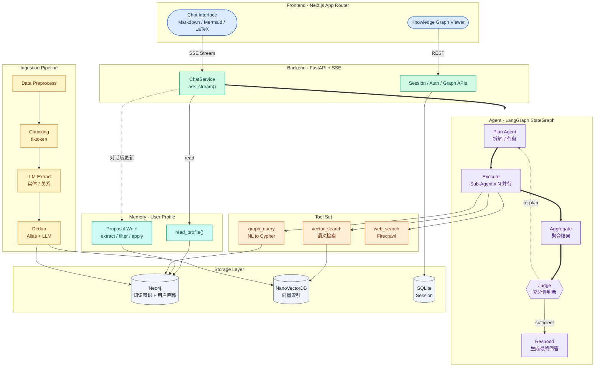

# KG-RAG

KG-RAG 是一个面向算法/竞赛知识的问答系统，采用 **Knowledge Graph (Neo4j) + RAG (NanoVectorDB) + Agentic (LangGraph)** 架构：

- **Neo4j**：存储知识图谱 + 用户画像（先修/改进/适用场景、掌握/薄弱/兴趣等）
- **NanoVectorDB**：存储文本 chunk 的向量索引，用于语义检索
- **LangGraph**：负责 Plan → Execute → Aggregate → Judge 的 agent 编排
- **FastAPI + SSE**：提供后端 API 与流式输出
- **Next.js (App Router)**：前端 UI（`frontend/`）

## 系统架构



## 快速开始（本地开发）

### 依赖

- Python 3.12（建议用 `uv` 管理环境与依赖）
- Node.js + Yarn（前端包管理固定使用 Yarn）
- Docker（本地启动 Neo4j）

### 1) 配置环境变量

复制一份模板并填写必要的 key：

```bash
cp .env.example .env
```

其中后端默认监听端口是 `8765`（见 `.env.example` 的 `API_PORT`），前端默认 API 地址也是 `http://localhost:8765`（可用 `NEXT_PUBLIC_API_URL` 覆盖）。

### 2) 启动 Neo4j

```bash
docker compose up -d neo4j
```

### 3) 启动后端（FastAPI）

```bash
uv sync
uv run kg-rag serve --host 0.0.0.0 --port 8765
```

如果你的环境里暂时没有脚本入口，也可以用模块方式启动：

```bash
uv run python -m kg_rag serve --host 0.0.0.0 --port 8765
```

### 4) 启动前端（Next.js）

```bash
cd frontend
yarn
yarn dev
```

如需指定后端地址，可在启动前端时设置：

```bash
NEXT_PUBLIC_API_URL=http://localhost:8765 yarn dev
```

## 主要 API（后端）

- `GET /health`
- `POST /api/v1/auth/register`
- `POST /api/v1/auth/login`
- `POST /api/v1/sessions`
- `GET /api/v1/sessions`
- `GET /api/v1/sessions/{session_id}`
- `DELETE /api/v1/sessions/{session_id}`
- `GET /api/v1/sessions/{session_id}/messages`
- `POST /api/v1/sessions/{session_id}/chat/stream`（SSE：`text/event-stream`）
- `GET /api/v1/graph/stats`
- `GET /api/v1/graph/overview`
- `GET /api/v1/graph/entities/search`
- `GET /api/v1/graph/entities/{entity_id}/neighbors`
